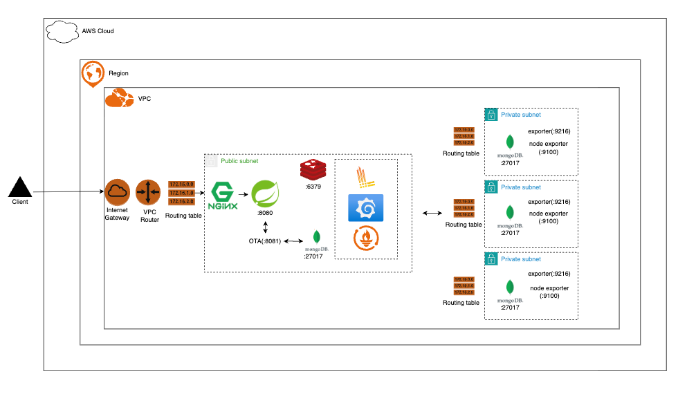

# Index

- A. [프로젝트 소개](#a-프로젝트-소개)
  - a. [프로젝트 설명](#a-프로젝트-설명)
  - b. [빌드 및 실행법](#b-빌드-및-실행법)
  - c. [사용 기술](#c-사용-기술)
- B. [아키텍처](#b-아키텍처)
  - a. [인프라 아키텍처](#a-인프라-아키텍처)
  - b. [데이터 모델](#b-데이터 모델)
- C. [프로젝트 달성 목표](#c-프로젝트-달성-목표)
- D. [Swagger API](#c-프로젝트-달성-목표)

---

# A. 프로젝트 소개

## a. 프로젝트 설명

`StayOps`는 숙박업의 객실·재고·예약·결제와 OTA 채널 동기화를 처리하는 PMS/CMS 백엔드 서버입니다.

### 주요 용어

- `PMS(Property Management System)` 는 숙소 내부 운영 시스템입니다. 객실, 재고, 예약, 고객, 결제, 정산처럼 숙소 운영의 기준 데이터를 관리합니다.

- `OTA(Online Travel Agency)` 는 Booking.com, Agoda, Expedia처럼 숙소를 외부 고객에게 판매하는 온라인 예약 채널입니다.

- `CMS(Channel Management System)/채널매니저`는 PMS와 여러 OTA 사이에서 객실 재고, 요금, 예약 정보를 동기화하는 시스템입니다. 여러 채널에서 같은 객실을 동시에 판매할 때 오버부킹을 방지하는 역할을 합니다.

### 실제 운영 환경의 동작 방식

실제 운영 환경에서는 PMS가 객실, 재고, 요금, 예약의 기준 시스템 역할을 합니다. 운영자가 PMS에서 객실 재고나 요금을 변경하면, 채널매니저가 이 정보를 여러 OTA에 전파합니다.

반대로 OTA에서 예약이 발생하면, OTA 또는 채널매니저가 PMS로 예약 정보를 전달합니다. PMS는 해당 예약을 내부 예약 데이터로 저장하고, 객실 재고를 차감한 뒤 다른 판매 채널에도 변경된 재고를 다시 동기화합니다.

이 구조를 통해 여러 OTA에서 동시에 객실을 판매하더라도, 각 채널의 재고 상태를 최대한 일관되게 유지하고 중복 예약을 방지합니다.

### 현재 프로젝트의 동작 방식

실제 OTA 연동은 파트너 계약, 인증 환경, 채널별 API 스펙이 필요하기 때문에 이 프로젝트에서는 Mock OTA라는 서버로 대체했습니다.

Mock OTA를 통해 PMS에서 OTA로 객실 재고를 동기화하는 흐름과, OTA에서 발생한 예약 Webhook을 PMS가 수신해 내부 예약과 재고에 반영하는 흐름을 구현했습니다.

## b. 빌드 및 실행법

### MongoDB, Redis 실행

```bash
docker compose up -d mongodb mongo-init redis mongo-ota
./gradlew :stayops-mock-ota:bootRun
./gradlew bootRun
```

### 애플리케이션 실행

```bash
./gradlew bootRun
./gradlew :stayops-mock-ota:bootRun
```

### 빌드 및 테스트

```bash
./gradlew clean build
./gradlew test
```

## b. 사용 기술

| Category | Tool/Library | Version |
  |---|---|---:|
| Language | Kotlin JVM | 2.2.21 |
| Java | JDK | 24 |
| Build | Gradle Wrapper | 9.3.1 |
| Spring | Spring Boot | 4.0.3 |
|  | Spring Boot Starter WebMVC | 4.0.3 |
|  | Spring Boot Starter Security | 4.0.3 |
|  | Spring Boot Starter Data MongoDB | 4.0.3 |
|  | Spring Boot Starter Data Redis | 4.0.3 |
|  | Spring Boot Starter Session Data Redis | 4.0.3 |
|  | Spring Boot Starter Validation | 4.0.3 |
|  | Spring Boot Starter Actuator | 4.0.3 |
| Server | Embedded Tomcat | 11.0.18 |
| Database | MongoDB | 8 |
|  | MongoDB Java Driver | 5.6.3 |
| Cache / Session | Redis | 7-alpine |
| External Java Library  | Swagger UI | 5.32.0 |
|  | Logback | 1.5.32 |
| Monitoring | Micrometer | 1.16.3 |
|  | Prometheus Metrics | 1.4.3 |
|  | Grafana | latest |
|  | Loki | latest |
|  | Promtail | latest |
| Test | Kotest | 6.1.0 |
|  | MockK | 1.14.2 |
|  | SpringMockK | 4.0.2 |
|  | MockWebServer | 4.12.0 |
|  | Testcontainers | Spring Boot managed |
| Deploy | Docker Image JDK | eclipse-temurin:24-jdk-alpine |
|  | Docker Image JRE | eclipse-temurin:24-jre-alpine |
| Load Test | k6 | not pinned in repo |

# B. 아키텍처

## a. 인프라 아키텍처

[인프라 설정](./infra)은 `production`과 `minimal`로 구분됩니다.

`Production`은 프로덕션 상황에서 발생할 수 있는 DB failover를 지원하는 Replica set(P-S-S) 구성과 로깅/메트릭을 지원하는 아키텍처 구성입니다. 

`Minimal`은 서비스를 저비용으로 유지하기 위한 최소 구성입니다. failover와 메트릭/로깅을 지원하지 않습니다.

프로젝트의 전반적인 설명은 `Production` 기준으로 합니다.

### Production


 
## b. 데이터 모델


---

# C. 프로젝트 달성 목표

## a. 프로젝트 달성 목표

- 호텔 예약 PMS, CMS 시스템을 분석하여 숙소 운영의 핵심 도메인(객실·재고·예약·채널·정산)을 운영 수준으로 재현
- 멀티 채널(자사 숙소 예매 사이트 + OTA) 환경에서 재고 정합성과 데이터 일관성을 보장하는 서버를 구축

## b. BE 역량 목표

- **동시성 제어** — 마지막 1객실 동시 예약 시 재고 정합성 보장
- **데이터 일관성** — Outbox 패턴으로 메시지 브로커 없이 채널 간 Eventually Consistent 동기화
- **도메인 모델링** — 11개 피처 모듈, 순수 도메인 객체, 도메인 이벤트 기반 크로스 모듈 연동

## c. 기술적 도전 과제

- 낙관적 락 동시성 제어: 마지막 1객실 동시 예약 → 정확히 1건만 성공
- Outbox 패턴: 메시지 브로커 없이 MongoDB + 스케줄러로 신뢰성 있는 비동기 동기화
- 도메인 이벤트: 모듈 간 결합도를 낮추면서 크로스 모듈 연동
- 부하 테스트

# D. Swagger API
