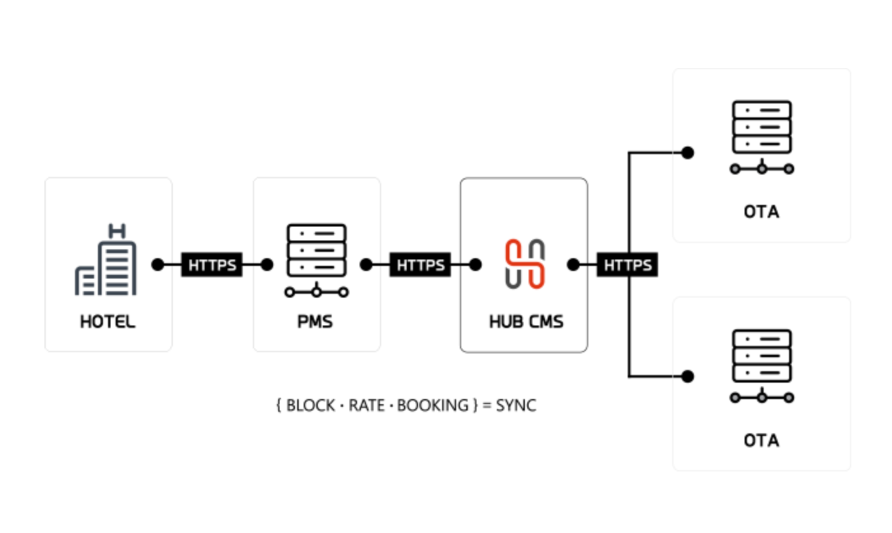
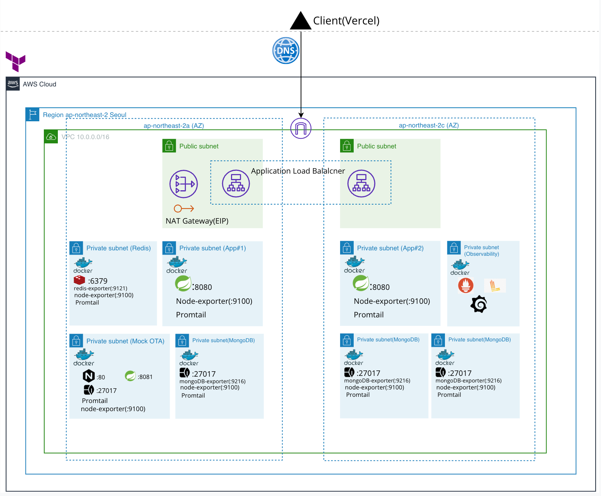
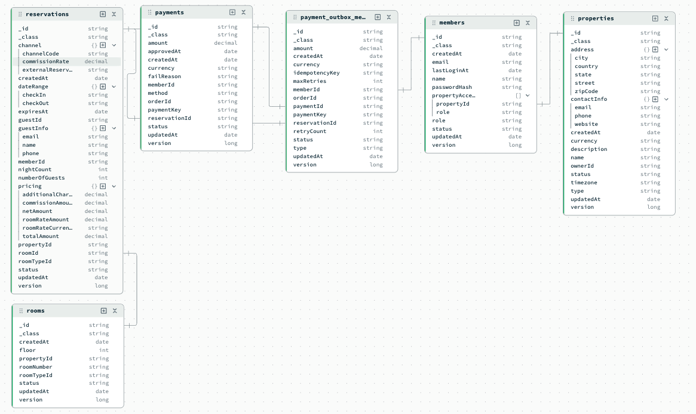
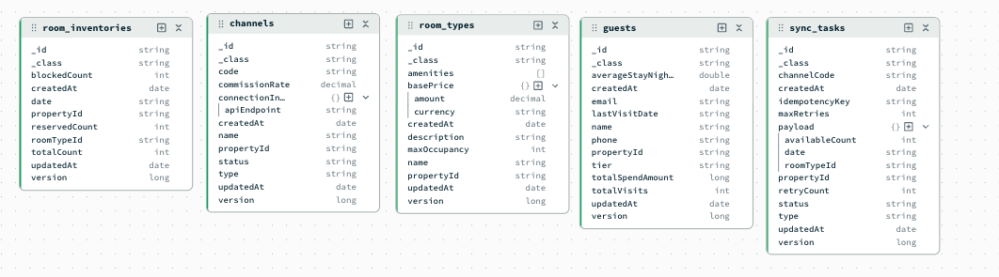
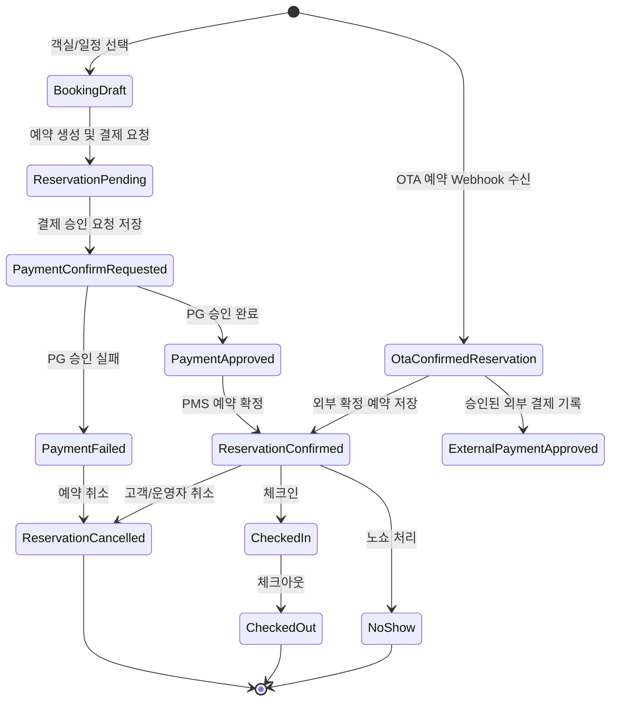

# Index

- A. [프로젝트 소개](#a-프로젝트-소개)
  - a. [프로젝트 설명](#a-프로젝트-설명)
  - b. [빌드 및 실행법](#b-빌드-및-실행법)
  - c. [사용 기술](#c-사용-기술)
- B. [아키텍처](#b-아키텍처)
  - a. [인프라 아키텍처](#a-인프라-아키텍처)
  - b. [데이터 모델](#b-데이터-모델)
- C. [프로젝트 달성 목표](#c-프로젝트-달성-목표)
  - a. [부하 테스트로 서버 성능 측정](#a-부하-테스트로-서버-성능-측정)
  - b. [PMS 기준 시스템과 외부 채널 분리 설계](#b-pms-기준-시스템과-외부-채널-분리-설계)
  - c. [예약 생명주기와 도메인 책임 분리](#c-예약-생명주기와-도메인-책임-분리)
  - d. [결제 승인 흐름의 외부 API 불일치 해결](#d-결제-승인-흐름의-외부-api-불일치-해결)
  - e. [OTA 재고 동기화와 Webhook 멱등성 설계](#e-ota-재고-동기화와-webhook-멱등성-설계)
- D. [문서 업데이트 내역](#d-문서-업데이트-내역)
---

# A. 프로젝트 소개

## a. 프로젝트 개요
 
`stayops`는 숙박업의 객실·재고·예약·결제와 재고 동기화를 처리하는 백엔드 서버입니다.

### 용어 설명



- `PMS(Property Management System)` 는 예약, 체크인/체크아웃, 객실 관리, 결제 및 매출 정산과 같은 작업을 통합 관리하는 시스템입니다.

- `CMS(Channel Management System), 채널매니저`는 PMS와 여러 OTA 사이에서 객실 재고, 요금, 예약 정보를 동기화하는 시스템입니다. 여러 채널에서 같은 객실을 동시에 판매할 때 오버부킹을 방지하는 역할을 합니다.

- `OTA(Online Travel Agency)` 는 Booking.com, Agoda, Expedia와 같이 온라인을 통해 숙박, 항공권 등 여행 상품을 중개하고 판매하는 플랫폼을 의미합니다.


### 실제 PMS/CMS 시스템 동작 방식

실제 숙박 시스템에서는 PMS가 객실, 재고, 요금, 예약의 기준 시스템 역할을 합니다. 운영자가 PMS에서 객실 재고나 요금을 변경하면, 채널매니저가 이 정보를 여러 OTA에 전파합니다.

반대로 OTA에서 예약이 발생하면, OTA 또는 채널매니저가 PMS로 예약 정보를 전달합니다. PMS는 해당 예약을 내부 예약 데이터로 저장하고, 객실 재고를 차감한 뒤 다른 판매 채널에도 변경된 재고를 다시 동기화합니다.

이 구조를 통해 여러 OTA에서 동시에 객실을 판매하더라도, 각 채널의 재고 상태를 최대한 일관되게 유지하고 중복 예약을 방지합니다.

### 현재 프로젝트의 동작 방식

현재 프로젝트는 PMS와 CMS의 역할을 하나의 서버에서 동작하도록 구성했습니다.

실제 OTA 서비스는 숙소 상품을 고객에게 노출하고 예약·취소·결제 상태를 관리하는 외부 판매 채널입니다. 숙소 입장에서는 PMS 또는 채널매니저를 통해 OTA에 객실 재고와 요금을 전달하고, OTA에서 발생한 예약·취소 이벤트를 다시 PMS로 수신해 내부 예약과 재고에 반영해야 합니다.

다만 실제 OTA를 PMS 서비스와 연동하려면 파트너 계약, 인증 환경, 채널별 API 스펙이 필요합니다. 이 프로젝트에서는 이러한 외부 연동 제약을 대체하기 위해 `Mock OTA` 서버와 별도의 Mock OTA DB를 구성했습니다.

`Mock OTA`의 역할은 PMS가 외부 판매 채널과 연동될 때 필요한 핵심 흐름을 검증하기 위한 시뮬레이터입니다. PMS에서 OTA로 객실 재고를 동기화하는 흐름, OTA에서 예약·취소가 발생했을 때 Webhook을 PMS가 수신해 내부 예약과 재고에 반영하는 흐름을 구현했습니다.

### 서버 모듈 구성

```text
apps/stayops-api   # PMS/CMS 백엔드 서버
apps/mock-ota      # 외부 OTA 연동을 대체하는 Mock OTA 서버
infra/             # 운영용/최소 실행용 Docker Compose 및 인프라 설정
loadtest/          # k6 부하 테스트와 테스트 데이터 seed script
```

`stayops-api`와 `mock-ota`는 서로 다른 서버에서 실행됩니다. 실제 운영 환경의 외부 OTA를 직접 연동할 수 없는 제약을 Mock OTA 서버로 분리해 재현했습니다.

## b. 빌드 및 실행법

### MongoDB, Redis 실행

```bash
docker compose up -d mongodb mongo-init redis mongo-ota
./gradlew :apps:mock-ota:bootRun
./gradlew :apps:stayops-api:bootRun
```

### 애플리케이션 실행

```bash
./gradlew :apps:stayops-api:bootRun
./gradlew :apps:mock-ota:bootRun
```

### 빌드 및 테스트

```bash
./gradlew clean build
./gradlew test
```

## b. 사용 기술

| Category | Tool/Library | Version |
  |---|---|---:|
| Language | Kotlin JVM | 2.2.21 |
| Java | JDK | 24 |
| Build | Gradle Wrapper | 9.3.1 |
| Spring | Spring Boot | 4.0.3 |
|  | Spring Boot Starter WebMVC | 4.0.3 |
|  | Spring Boot Starter Security | 4.0.3 |
|  | Spring Boot Starter Data MongoDB | 4.0.3 |
|  | Spring Boot Starter Data Redis | 4.0.3 |
|  | Spring Boot Starter Session Data Redis | 4.0.3 |
|  | Spring Boot Starter Validation | 4.0.3 |
|  | Spring Boot Starter Actuator | 4.0.3 |
| Server | Embedded Tomcat | 11.0.18 |
| Database | MongoDB | 8 |
|  | MongoDB Java Driver | 5.6.3 |
| Cache / Session | Redis | 7-alpine |
| External Java Library  | Logback | 1.5.32 |
| Monitoring | Micrometer | 1.16.3 |
|  | Prometheus Metrics | 1.4.3 |
|  | Grafana | latest |
|  | Loki | latest |
|  | Promtail | latest |
| Test | Kotest | 6.1.0 |
|  | MockK | 1.14.2 |
|  | SpringMockK | 4.0.2 |
|  | MockWebServer | 4.12.0 |
|  | Testcontainers | Spring Boot managed |
| Deploy | Docker Image JDK | eclipse-temurin:24-jdk-alpine |
|  | Docker Image JRE | eclipse-temurin:24-jre-alpine |
| Load Test | k6 | not pinned in repo |

# B. 아키텍처

## a. 인프라 아키텍처

[인프라 설정](./infra)은 `Production`과 `Minimal`로 구분됩니다.

`Production`은 서버 Scale-out 및 DB Replica set(P-S-S)과 Logging/Metric을 지원하는 아키텍처입니다.

`Minimal`은 서비스를 '저비용으로 유지하기 위한 최소 구성'으로 단일 인스턴스로 구성되어 가용성을 보장하지 않습니다.

프로젝트의 전반적인 설명은 `Production` 기준으로 합니다.

### Production


 
## b. 데이터 모델




---

# C. 프로젝트 달성 목표

서비스는 출시가 아니라 출시 이후 안정적으로 동작하는 궤도까지 올라야 시작이라고 생각합니다.

이 프로젝트에서는 실제 서비스를 운영하기 위한 상황을 예상하여 서비스 가용성과 확장성, 장애 대응 가능성을 검증하는 것을 주요 목표로 삼았습니다.

또한 숙박 도메인에서 발생하는 숙소 예약 및 결제, 재고 동기화, 외부 API 연동(PG 호출)에서 생길 수 있는 문제를 예상하고 이를 해결합니다.

## a. 부하 테스트로 서버 성능 측정

DAU, 결제 전환율 같은 운영 기준 지표가 없는 상태에서 애플리케이션과 DB 서버가 어느 정도의 트래픽을 수용할 수 있는지 확인할 필요가 있었습니다.

로깅과 메트릭을 구성하고 `k6` 부하테스트 tool을 사용해 부하를 점진적으로 올려가며 Smoke test부터 Break-point 테스트를 진행하면서 현재 서버 스펙에서 DB 병목을 확인하고 시스템의 처리 한계와 확장 기준을 수치로 파악했습니다.

부하 테스트 중에 API 지연율 문제를 발견하고 'Pagenation'과 '복합 인덱스'를 적용해 p95 응답 시간을 **2.25s에서 230ms**로 개선했습니다.

또한 Failover 테스트를 통해 MongoDB의 Replica-Set 구성에서 장애 시 발생하는 election 과정의 정상 동작을 검증하고 장애 상황을 대비한 timeout, 서버 응답 개선, 재시도 전략을 도입했습니다. 

자세한 해결 과정은 [블로그](https://www.romedev.kr/blog/load_test_on_mongodb)에 담았습니다.

## b. 가용성을 고려한 시스템 설계

중단없는 서비스를 위해서 DB 뿐만 아니라 애플리케이션 서버도 Scale-out할 필요성이 생겼습니다.

가용성을 도모한다는 것은 단순히 서버를 증설하는 것 뿐만 아니라 배포 중 서버 처리량이 가중되거나 기존에 처리하던 요청을 마무리해야하는 등 여러 관리 포인트가 생깁니다.

이를 위해 `처리율 제한`과 `graceful-shutdown`를 도입하여 서비스 가용성을 개선했습니다.

또한 시스템 설계 과정에서 생기는 인프라 설정의 번거로움을 `Terraform`을 도입하여 간편화했습니다.

Scale-out 의사 결정 및 개선 과정을 [블로그](https://www.romedev.kr/blog/how_scale_out_server)에 담았습니다.

## c. 도메인 설계에 대한 고민

숙박 도메인에서 '예약'은 단순히 예약 데이터를 저장하는 문제가 아니라, 예약이 성립되기 전의 준비 단계, 결제 승인, 숙소의 예약 확정, OTA를 통한 외부 확정 예약처럼 서로 다른 논리적 개념이 하나의 흐름 안에 함께 존재합니다. 

이런 개념들을 하나의 서비스 로직에서 상태값으로만 처리하면, 예약이 언제 재고를 점유하는지, 결제 실패가 예약 어떤 영향을 주는지, 외부 채널 예약을 내부 예약과 같은 방식으로 다뤄도 되는지 같은 규칙이 흐려질 수 있다고 판단했습니다.

이를 보다 복잡하지 않게 다룰 수 있도록 도메인 주도 설계(Domain Driven design)를 도입해 예약, 결제, 재고와 같은 주요 개념들을 각각의 책임을 가진 도메인으로 분리했습니다. 

예약은 투숙 기간과 예약 생명주기를, 결제는 외부 PG 승인과 결제 상태 전이, 재고는 날짜별 객실 점유와 복원, 채널은 OTA 연동과 동기화 작업을 담당하도록 경계를 나눴습니다.

도메인의 논리적 개념을 코드의 계층과 경계로 분리함으로써, 고객 직접 예약과 OTA 예약처럼 서로 다른 예약 흐름을 같은 시스템 안에서 다루면서도 예약·결제·재고·채널의 책임을 명확하게 유지할 수 있도록 설계할 수 있었습니다.



직접 예약과 OTA 예약의 흐름을 분리해, 예약이 언제 재고를 점유하는지, 결제 상태가 언제 변경되는지, 외부 채널 예약을 언제 확정으로 볼 것인지를 명확하게 다룰 수 있도록 설계했습니다.

도메인 경계에 대한 맥락을 [도메인 기능 카탈로그](./docs/context/domain-model/02-domain-model-function-catalog.md), [도메인 진단 기록](./docs/context/domain-model/03-domain-dia gnosis.md), [결제 Outbox 설계](./docs/context/domain-model/blog-payment-outbox-refactoring.md)에 문서로 담았습니다.

---

# D. 문서 업데이트 내역

last updated: 2026-06-09
