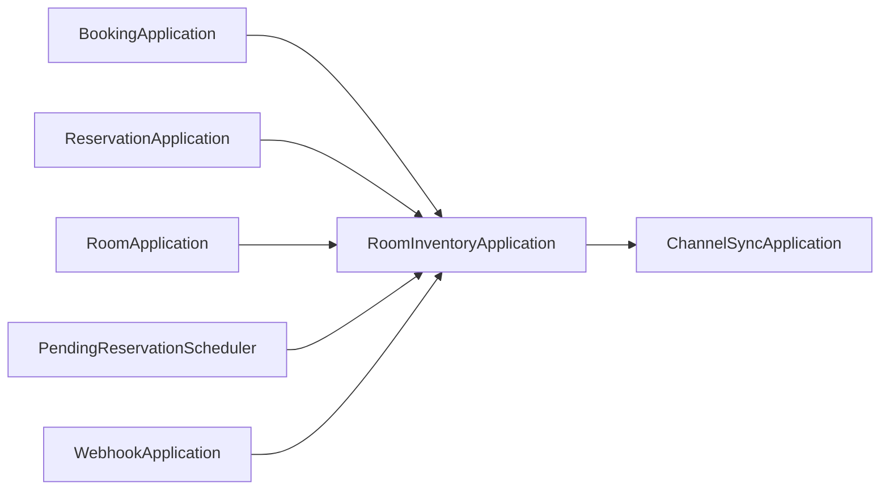
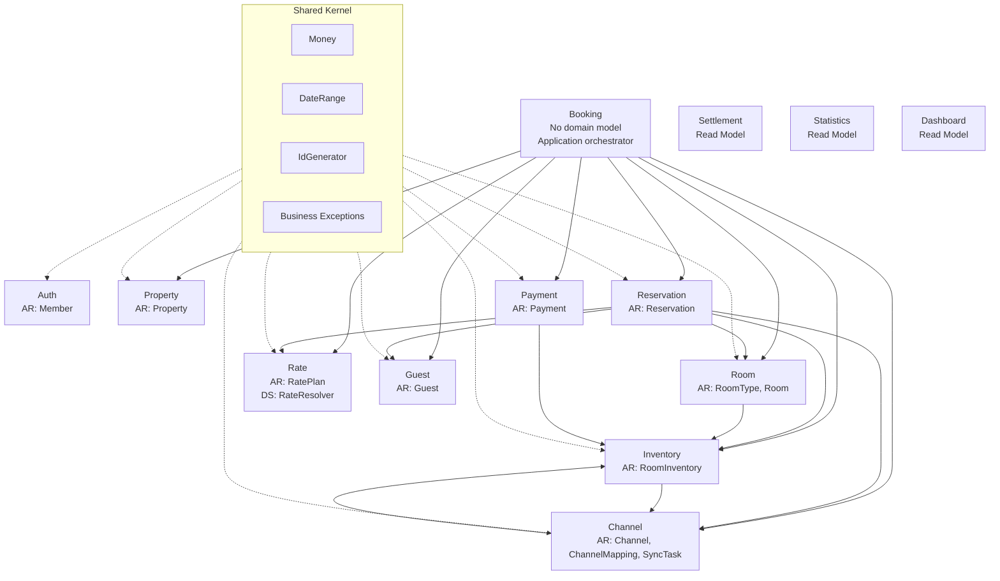

# StayOps 모듈 분리 기록: 도메인 경계를 먼저 그리기

작성 시작일: 2026-04-11

일단 코드는 동작한다. StayOps는 숙박시설의 예약, 객실 재고, 요금, 채널 연동, 정산을 다루는 PMS이고, 지금까지 필요한 기능을 하나씩 구현해 왔다.

그런데 기능이 어느 정도 쌓이고 나서 코드를 다시 보니 다른 문제가 보이기 시작했다. 패키지는 `property`, `room`, `inventory`, `rate`, `reservation`, `channel`처럼 도메인별로 나뉘어 있지만, 실제 의존성은 그렇게 선명하지 않았다. 동작하는 코드와 좋은 구조는 같은 말이 아니었다.

이번 리팩터링의 목표는 단순히 디렉터리를 여러 개로 쪼개는 것이 아니다. 먼저 “어떤 도메인이 어떤 데이터를 소유하는가”, “어떤 기능은 반드시 그 도메인을 통해서만 실행되어야 하는가”, “어떤 참조가 Bounded Context 경계를 흐리고 있는가”를 확인한다. 그 다음에 Gradle subproject로 옮긴다.

이 글은 그 과정을 누적 기록하는 작업 로그다. 결론이 바뀌면 기존 결정을 지우기보다, 날짜별로 왜 바뀌었는지 남긴다.

## 개요

현재 작성한 코드의 문제점은 크게 세 가지다.

첫째, 코드가 복잡해졌다. 하나의 유스케이스가 여러 도메인을 조합하는 것은 자연스럽지만, 조합의 책임과 도메인 규칙의 책임이 섞이기 시작했다.

둘째, 컨텍스트가 불분명하다. 패키지 이름은 도메인처럼 보이지만, 어떤 Context가 어떤 데이터를 유일하게 소유하는지 명확히 말하기 어려운 지점이 있다. 특히 `Booking`은 고객 예매라는 유스케이스 이름으로는 유효하지만, 자체 Aggregate Root가 없다.

셋째, 코드 의존성이 경계를 흐린다. `BookingApplication`, `ReservationApplication`, `RoomApplication`, `WebhookApplication`, `PendingReservationScheduler`가 모두 `RoomInventoryApplication`을 직접 참조한다. 그리고 `RoomInventoryApplication`은 다시 `ChannelSyncApplication`을 호출한다.

이 상태에서 바로 Gradle module을 나누면, 도메인 경계를 정리하는 것이 아니라 현재의 결합을 그대로 모듈 의존성으로 고정할 가능성이 크다. 그래서 첫 단계는 코드 이동이 아니라 개념과 이름을 먼저 정리하는 것으로 잡았다.

## 시작점: 코드는 나뉘어 있지만 모듈은 아직 나뉘지 않았다

현재 StayOps의 주요 패키지는 도메인 이름을 기준으로 나뉘어 있다.

```text
com.stayops.property
com.stayops.room
com.stayops.inventory
com.stayops.rate
com.stayops.guest
com.stayops.reservation
com.stayops.payment
com.stayops.channel
com.stayops.booking
```

패키지만 보면 이미 Bounded Context처럼 보인다. 그러나 실제 의존성을 보면 바로 모듈로 분리하기 어렵다.



`BookingApplication`, `ReservationApplication`, `RoomApplication`, `WebhookApplication`, `PendingReservationScheduler`가 모두 `RoomInventoryApplication`을 직접 참조한다. 그리고 `RoomInventoryApplication`은 다시 `ChannelSyncApplication`을 직접 호출한다.

이 상태에서 Gradle subproject를 먼저 만들면, 모듈 의존성이 도메인 경계를 설명하기보다 현재 결합을 그대로 굳히게 된다. 그래서 첫 단계는 코드 이동이 아니라 문서화와 진단으로 잡았다.

## 우리가 먼저 정한 기준

이번 작업에서 합의한 기준은 다음과 같다.

- 새 브랜치를 만들지 않고 현재 `refactor/domain-module` 브랜치에서 진행한다.
- 그림은 Mermaid로 작성한다.
- Bounded Context는 Gradle subproject의 기본 단위로 본다.
- 모듈 토폴로지는 BC별 전체 레이어 모듈로 간다. 즉 한 BC 모듈 안에 `api/application/domain/infrastructure`를 함께 둔다.
- `shared`는 공통 값 객체, 공통 예외, ID 생성 포트 같은 진짜 공유 커널만 담는다.
- 각 하위 단계는 코드 작성, 검증, 기록 후 멈춘다.

참고한 기준은 두 가지다.

- 카카오페이 기술 블로그의 DDD 적용 글: Bounded Context를 Gradle subproject 단위로 보고, Aggregate Root를 일관성 경계로 다룬다.
- Application Service와 Domain Service 책임 구분 글: Application Service는 유스케이스 조율자이고, Domain Service는 단일 Entity/Value Object에 넣기 어려운 도메인 규칙을 담는다는 기준을 사용한다.

## Domain Service와 Application Service부터 나눠보자

처음에는 Application layer에 대한 이해가 부족했다. 이름에 `Service`가 붙으면 모두 비슷한 계층처럼 보였고, `application/service` 패키지에 있는 클래스도 자연스럽게 `XXXService`라고 부르고 있었다.

하지만 다시 정리해 보니 Application layer는 도메인 규칙을 직접 소유하는 계층이 아니었다. 더 정확히는 유스케이스를 실행하는 오케스트레이션 퍼사드에 가깝다. 요청을 받고, 필요한 Aggregate를 조회하고, 도메인 객체나 Domain Service에 일을 시키고, 저장하고, 외부 port를 호출하는 계층이다.

반대로 Domain Service는 도메인 규칙을 담는다. 단일 Entity나 Value Object에 넣기 자연스럽지 않은 규칙이 있을 때 도메인 모델의 일부로 둔다. 그래서 먼저 이름부터 경계를 드러내도록 바꾸기로 했다.

우리는 다음 규칙을 사용한다.

- Application layer에서 유스케이스를 오케스트레이션하는 facade는 `XXXApplication`으로 부른다.
- Domain layer의 도메인 규칙 서비스는 `XXXService`로 부른다.
- `Gateway`, `Adapter`, `Verifier`, `Provider`는 Domain Service가 아니라 port/contract 이름으로 유지한다.

이 기준으로 보면 현재 `BookingApplication`, `RoomInventoryApplication`, `ReservationApplication`은 이미 Application layer facade 이름을 따른다.

반면 `AuthService`, `CustomerAuthService`, `SettlementQueryService`는 application layer에 있으므로 이름을 바꿀 후보가 된다. 각각 `AuthApplication`, `CustomerAuthApplication`, `SettlementQueryApplication`이 더 정확하다.

Domain Service 쪽에서는 `RateResolver`가 핵심 후보로 남는다. 이 클래스는 여러 `RatePlan` 중 적용 가능한 요금제를 고르고, 우선순위로 정렬하고, 없으면 객실 기본 요금으로 fallback한다. 이 로직은 Rate 도메인의 규칙이지만 `RatePlan` 하나의 책임으로 넣기는 어렵다. 그래서 Domain Service로 본다.

## 첫 번째 도메인 지도

현재 AS-IS 기준의 Context Map은 다음처럼 정리했다.



이 지도에서 바로 보이는 문제가 있다.

`Booking`은 고객 예매라는 유스케이스 이름으로는 유효하지만 자체 Aggregate Root가 없다. 지금은 Reservation, Payment, Inventory, Guest, Rate, Property, Room, Channel을 조합하는 Application module에 가깝다.

`Inventory`는 `RoomInventory`라는 Aggregate Root를 갖고 있고 재고 변경 규칙 자체도 도메인 모델 안에 있다. 하지만 외부에서 `RoomInventoryApplication`을 직접 참조하는 곳이 많다. 이는 Gradle 모듈 분리 전 반드시 줄여야 할 결합이다.

`Channel`은 하나의 Context 안에 채널 마스터, OTA 매핑, SyncTask outbox, webhook idempotency record가 함께 있다. 당장 쪼개지는 않더라도 하위 도메인을 문서상 분리해서 관리해야 한다.

`Settlement`, `Statistics`, `Dashboard`는 현재 Aggregate가 없는 read model이다. 별도 모듈로 만들 수는 있지만 도메인 모델 분리의 1차 대상은 아니다.

## 첫 번째 결론: 바로 모듈을 만들지 않는다

초기에 하고 싶었던 작업은 “Bounded Context마다 Gradle subproject를 만든다”였다. 하지만 현재 구조에서 바로 하면 순환 의존이 생길 가능성이 크다.

특히 다음 참조가 문제다.

```text
BookingApplication -> RoomInventoryApplication
ReservationApplication -> RoomInventoryApplication
RoomApplication -> RoomInventoryApplication
WebhookApplication -> RoomInventoryApplication
PendingReservationScheduler -> RoomInventoryApplication
RoomInventoryApplication -> ChannelSyncApplication
```

이 참조들은 모두 컴파일은 되지만, Bounded Context 관점에서는 질문을 남긴다.

- Booking이 정말 Inventory Application 전체를 알아야 하는가?
- Reservation이 필요한 것은 `reserve/release` 계약뿐 아닌가?
- Inventory가 OTA 동기화를 Channel Application 직접 호출로 알아야 하는가?
- 재고 변경과 OTA 동기화는 동기 호출인가, 도메인 이벤트인가, 아니면 port 계약인가?

첫 번째 리팩터링 방향은 “Application이 다른 Application을 직접 호출하지 않게 한다”이다. 필요한 기능은 소유 Context가 좁은 port로 노출한다.

예를 들어 Booking과 Reservation이 필요한 것은 Inventory 전체가 아니라 예약용 재고 차감/복원 계약이다.

```text
InventoryReservationPort
  - reserve(propertyId, roomTypeId, date)
  - release(propertyId, roomTypeId, date)
```

이 port를 Inventory가 소유하면 Booking은 Inventory Application 구현 전체가 아니라 재고 예약 계약에만 의존한다. 이 방향은 이후 Gradle subproject 분리에도 더 잘 맞는다.

## 결정 로그

### 2026-04-11

- 현재 브랜치 `refactor/domain-module`에서 진행하기로 했다.
- Mermaid를 도메인 그림의 기본 형식으로 정했다.
- 모듈 토폴로지는 BC별 전체 레이어 모듈로 정했다.
- `docs/domain-model/01-bounded-context-map.md`에 AS-IS Context Map을 기록했다.
- `docs/domain-model/02-domain-model-function-catalog.md`에 도메인 모델과 기능 소유권을 정리했다.
- `docs/domain-model/03-domain-diagnosis.md`에 모듈 분리 blocker를 기록했다.
- Application layer facade는 `XXXApplication`, Domain Service는 `XXXService`로 명명하기로 했다.
- 현재 엄격한 의미의 Domain Service는 `RateResolver` 하나로 판단했다.
- `PaymentGateway`, `ChannelSyncAdapter`, `ChannelInventoryQueryAdapter`, `SignatureVerifier`는 Domain Service가 아니라 port/contract로 판단해 이름 유지 대상으로 분류했다.
- 첫 번째 코드 변경은 이름으로 계층 경계를 드러내는 작업으로 한정했다.
- 변경 전 `./gradlew test`를 실행했고 전체 테스트가 통과했다.
- `src/test/kotlin/com/stayops/architecture/ServiceNamingConventionTest.kt`를 먼저 추가해 Application facade가 `*Service` 파일명을 쓰지 않고, Rate 도메인 서비스가 `RateResolverService`로 존재해야 한다는 규칙을 RED로 확인했다.
- 이후 `AuthService`를 `AuthApplication`으로, `CustomerAuthService`를 `CustomerAuthApplication`으로, `SettlementQueryService`를 `SettlementQueryApplication`으로, `RateResolver`를 `RateResolverService`로 변경했다.
- 판단 근거는 단순하다. 앞의 세 클래스는 `application/service` 아래에서 유스케이스를 조율하는 facade이고, `RateResolver`는 `rate/domain/service` 아래에서 여러 `RatePlan` 중 적용 가능한 요금 정책을 고르는 도메인 규칙을 담기 때문이다.
- 변경 후 `./gradlew :test --tests com.stayops.architecture.ServiceNamingConventionTest`와 `./gradlew test`를 실행했고 모두 통과했다.

## 다음에 이어서 쓸 내용

- `InventoryReservationPort`를 도입할지, 도입한다면 어느 패키지가 소유할지.
- `RoomInventoryApplication -> ChannelSyncApplication` 직접 호출을 port로 바꿀지, 도메인 이벤트로 바꿀지.
- `Booking`을 독립 Bounded Context로 볼지, 고객 예매 application module로 볼지.
- 첫 Gradle subproject를 `stayops-shared`로 시작할지, `stayops-property`까지 함께 분리할지.
