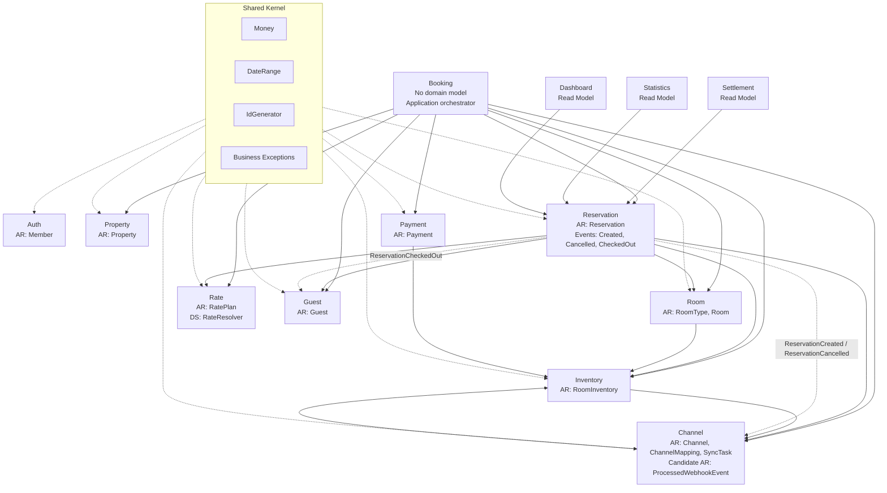

# StayOps Bounded Context Map (AS-IS)

---

## 2026-04-11 기준선

이 문서는 모듈 분리 전 AS-IS 도메인 경계를 기록한다. 기준은 다음과 같다.

- 참조 글: 카카오페이 기술 블로그, "카카오페이 여신코어 DDD(Domain Driven Design, 도메인 주도 설계)로 구축하기", 2025-05-23.
- 적용 원칙: Bounded Context는 도메인 모델이 적용되는 명시적 경계이며, 관리 가능한 하위 도메인으로 분할하고, Gradle subproject 단위가 된다.
- 적용 원칙: Aggregate는 트랜잭션 일관성 경계이며, Aggregate 내부 Entity/Value Object는 Aggregate Root를 통해 접근하고 수정한다.
- 이번 브랜치 결정: 새 브랜치를 만들지 않고 현재 `refactor/domain-module`에서 진행한다.
- 그림 형식 결정: Mermaid를 기본 문서화 형식으로 사용한다.
- 모듈 토폴로지 결정: BC별 전체 레이어 모듈을 사용한다. 즉 각 BC 모듈이 `api/application/domain/infrastructure`를 포함하고, 공통 코드는 shared 모듈로 분리한다.

## Mermaid Context Map



### AS-IS 판정 메모

- `PropertyAccess`는 별도 식별자와 생명주기가 없으므로 현재 코드 기준으로는 Entity보다 Member Aggregate 내부 Value Object에 가깝다.
- `ProcessedWebhookEvent`는 repository로 독립 저장되지만 현재 행위가 거의 없는 멱등성 기록이다. Channel Context 내부 Aggregate Root 후보로 유지하되, 모듈 분리 전에 명확한 소유권과 명명 검토가 필요하다.
- `Booking`은 고객 예매 플로우의 유스케이스 이름으로는 유효하지만 자체 도메인 모델이 없다. BC로 둘지, Reservation/Payment를 조합하는 application module로 둘지는 모듈 분리 설계 단계에서 재확인한다.
- `Settlement`, `Statistics`, `Dashboard`는 현재 Aggregate가 없는 read model이다. 별도 BC 모듈로 둘 수 있으나 도메인 모듈 우선 분리 대상은 아니다.

---

## 전체 Context Map

```
┌─────────────────────────────────────────────────────────────────────────┐
│                        StayOps PMS Domain                              │
│                                                                         │
│  ┌── 회원 컨텍스트 ─────────┐  ┌── 숙소 컨텍스트 ─────────┐           │
│  │                          │  │                          │           │
│  │  aggregate root          │  │  aggregate root          │           │
│  │  ┌────────────┐          │  │  ┌────────────┐          │           │
│  │  │   Member   │          │  │  │  Property  │          │           │
│  │  └─────┬──────┘          │  │  └────────────┘          │           │
│  │        │                 │  │        │                 │           │
│  │        ▼                 │  │        ├─▶ vo: Address   │           │
│  │  entity                  │  │        └─▶ vo: ContactInfo│          │
│  │  ┌──────────────┐       │  │                          │           │
│  │  │PropertyAccess│       │  └──────────────────────────┘           │
│  │  └──────────────┘       │                                         │
│  │                          │                                         │
│  └──────────────────────────┘                                         │
│                                                                         │
│  ┌── 객실 컨텍스트 ─────────┐  ┌── 재고 컨텍스트 ─────────┐           │
│  │                          │  │                          │           │
│  │  aggregate root          │  │  aggregate root          │           │
│  │  ┌────────────┐          │  │  ┌──────────────┐       │           │
│  │  │    Room    │          │  │  │ RoomInventory │       │           │
│  │  └────────────┘          │  │  └──────────────┘       │           │
│  │                          │  │                          │           │
│  │  aggregate root          │  │  port:                   │           │
│  │  ┌────────────┐          │  │  RoomInventoryCache      │           │
│  │  │  RoomType  │          │  │                          │           │
│  │  └────────────┘          │  └──────────────────────────┘           │
│  │                          │                                         │
│  └──────────────────────────┘                                         │
│                                                                         │
│  ┌── 요금 컨텍스트 ─────────┐  ┌── 고객 컨텍스트 ─────────┐           │
│  │                          │  │                          │           │
│  │  aggregate root          │  │  aggregate root          │           │
│  │  ┌────────────┐          │  │  ┌────────────┐          │           │
│  │  │  RatePlan  │          │  │  │   Guest    │          │           │
│  │  └─────┬──────┘          │  │  └─────┬──────┘          │           │
│  │        │                 │  │        │                 │           │
│  │        ▼                 │  │        ▼                 │           │
│  │  vo: DayOfWeekRate       │  │  vo: VisitSummary        │           │
│  │                          │  │                          │           │
│  │  domain service:         │  │                          │           │
│  │  RateResolver            │  │                          │           │
│  │                          │  │                          │           │
│  └──────────────────────────┘  └──────────────────────────┘           │
│                                                                         │
│  ┌── 예약 컨텍스트 ──────────────────────────────────────────┐         │
│  │                                                           │         │
│  │  aggregate root                                           │         │
│  │  ┌─────────────┐                                          │         │
│  │  │ Reservation │                                          │         │
│  │  └──────┬──────┘                                          │         │
│  │         │                                                 │         │
│  │         ├─▶ vo: BookingChannel                            │         │
│  │         ├─▶ vo: GuestInfo                                 │         │
│  │         ├─▶ vo: ReservationPricing                        │         │
│  │         └─▶ vo: ReservationSearchCriteria                 │         │
│  │                                                           │         │
│  │  domain event:                                            │         │
│  │  ┌────────────────────┐ ┌──────────────────────┐         │         │
│  │  │ReservationCreated  │ │ReservationCancelled  │         │         │
│  │  └────────────────────┘ └──────────────────────┘         │         │
│  │  ┌────────────────────────┐                               │         │
│  │  │ReservationCheckedOut   │                               │         │
│  │  └────────────────────────┘                               │         │
│  │                                                           │         │
│  └───────────────────────────────────────────────────────────┘         │
│                                                                         │
│  ┌── 예약-고객 컨텍스트 (Booking) ───────────────────────────┐         │
│  │                                                           │         │
│  │  aggregate root: ❌ 없음                                  │         │
│  │  domain model:   ❌ 없음 (domain/ 디렉토리 부재)           │         │
│  │                                                           │         │
│  │  ※ Application Service 만 존재:                           │         │
│  │     BookingApplication (예약 생성 + 결제 확인 + 취소)      │         │
│  │     BookingSearchApplication (숙소/객실/가용성 검색)       │         │
│  │     CustomerAuthService (고객 로그인)                     │         │
│  │                                                           │         │
│  │  ※ Reservation, Payment, Guest 등 타 도메인 모델을        │         │
│  │     직접 조합하는 오케스트레이터 역할                       │         │
│  │                                                           │         │
│  └───────────────────────────────────────────────────────────┘         │
│                                                                         │
│  ┌── 결제 컨텍스트 ─────────┐  ┌── 채널 컨텍스트 ──────────────────┐  │
│  │                          │  │                                   │  │
│  │  aggregate root          │  │  aggregate root                   │  │
│  │  ┌────────────┐          │  │  ┌────────────┐                   │  │
│  │  │  Payment   │          │  │  │  Channel   │                   │  │
│  │  └────────────┘          │  │  └────────────┘                   │  │
│  │                          │  │        └─▶ vo: ChannelConnectionInfo│ │
│  │  port:                   │  │                                   │  │
│  │  PaymentGateway          │  │  aggregate root                   │  │
│  │                          │  │  ┌────────────────┐               │  │
│  │  sealed exception:       │  │  │ChannelMapping  │               │  │
│  │  PaymentGatewayException │  │  └───────┬────────┘               │  │
│  │                          │  │          └─▶ vo: MappingEntry     │  │
│  └──────────────────────────┘  │                                   │  │
│                                │  aggregate root                   │  │
│                                │  ┌────────────────┐               │  │
│                                │  │   SyncTask     │               │  │
│                                │  └────────────────┘               │  │
│                                │                                   │  │
│                                │  aggregate root                   │  │
│                                │  ┌────────────────────────┐       │  │
│                                │  │ProcessedWebhookEvent   │       │  │
│                                │  └────────────────────────┘       │  │
│                                │                                   │  │
│                                │  port:                             │  │
│                                │  ChannelSyncAdapter                │  │
│                                │  ChannelInventoryQueryAdapter      │  │
│                                │  ChannelAdapterProvider            │  │
│                                │  SignatureVerifier                 │  │
│                                │                                   │  │
│                                └───────────────────────────────────┘  │
│                                                                         │
│  ┌── 읽기 전용 컨텍스트 (도메인 모델 없음) ─────────────────────────┐  │
│  │                                                                   │  │
│  │  정산 (Settlement)        통계 (Statistics)     대시보드 (Dashboard)│ │
│  │  ├── SettlementQuery     ├── StatisticsQuery   ├── DashboardQuery  │ │
│  │  │   Repository (Port)   │   Repository (Port)  │   (Application)  │ │
│  │  └── DTO 기반 집계       └── DTO 기반 집계      └── DTO 기반 집계  │ │
│  │                                                                   │  │
│  │  ※ Aggregate Root 없음. 다른 Context 의 데이터를 읽기만 함        │  │
│  │  ※ CQRS 의 Read Model 에 해당                                     │  │
│  │                                                                   │  │
│  └───────────────────────────────────────────────────────────────────┘  │
│                                                                         │
│  ════════════════════════════════════════════════════════════════════   │
│  Shared Kernel (공유 도메인)                                           │
│  ┌─────────────────────────────────────────────────────────────────┐   │
│  │  vo: Money          vo: DateRange       vo: PagedResult         │   │
│  │  port: IdGenerator  exception: Business/NotFound/Conflict/...   │   │
│  │  ⚠️ PropertyAccessChecker (비즈니스 로직 — 후순위 이전 대상)     │   │
│  └─────────────────────────────────────────────────────────────────┘   │
│                                                                         │
└─────────────────────────────────────────────────────────────────────────┘
```

---

## Context 간 의존성 흐름

```
                        ┌──────────────┐
                        │   Booking    │ (고객 예약 플로우)
                        │ ❌ domain 없음│
                        └──────┬───────┘
                               │ Reservation, Payment, Guest,
                               │ Inventory, Rate, Property,
                               │ Room, Channel 직접 참조
                               ▼
┌──────────┐    ┌──────────────────────────┐    ┌──────────┐
│  Auth    │    │      Reservation         │    │ Payment  │
│          │    │  (핵심 도메인)             │    │          │
└──────────┘    └──────────┬───────────────┘    └──────────┘
                           │
            ┌──────────────┼──────────────┐
            │              │              │
            ▼              ▼              ▼
     ┌──────────┐   ┌──────────┐   ┌──────────┐
     │Inventory │   │   Room   │   │   Rate   │
     │          │◀──│          │   │          │
     └────┬─────┘   └──────────┘   └──────────┘
          │
          ▼
     ┌──────────┐
     │ Channel  │  ←── ReservationCreated 이벤트 수신
     │          │  ←── ReservationCancelled 이벤트 수신
     └──────────┘

이벤트 흐름:
  Reservation ──event──▶ Channel (ChannelEventHandler)
  Reservation ──event──▶ Guest (GuestEventHandler)

⚠️ Application 레이어 크로스 참조 (문제):
  booking.BookingApplication       ──▶ inventory.application.RoomInventoryApplication
  channel.WebhookApplication       ──▶ inventory.application.RoomInventoryApplication
  reservation.ReservationApplication ──▶ inventory.application.RoomInventoryApplication
  room.RoomApplication             ──▶ inventory.application.RoomInventoryApplication
  inventory.RoomInventoryApplication ──▶ channel.application.ChannelSyncApplication
```

---

## Context 요약표

| # | Bounded Context | Aggregate Root 수 | Entity 수 | VO 수 | Domain Event | 비고 |
|---|---|---|---|---|---|---|
| 1 | 회원 (Member) | 1 (Member) | 1 (PropertyAccess) | 3 | 0 | 독립적 |
| 2 | 숙소 (Property) | 1 (Property) | 0 | 4 | 0 | 독립적 |
| 3 | 객실 (Room) | 2 (Room, RoomType) | 0 | 1 | 0 | Inventory 와 양방향 |
| 4 | 재고 (Inventory) | 1 (RoomInventory) | 0 | 0 | 0 | **가장 많이 참조됨** |
| 5 | 요금 (Rate) | 1 (RatePlan) | 0 | 3 | 0 | 독립적, RateResolver |
| 6 | 고객 (Guest) | 1 (Guest) | 0 | 2 | 0 | 거의 독립 |
| 7 | 예약 (Reservation) | 1 (Reservation) | 0 | 5 | 3 | 핵심 도메인 |
| 8 | **예약-고객 (Booking)** | **0** | 0 | 0 | 0 | **❌ domain 부재** |
| 9 | 결제 (Payment) | 1 (Payment) | 0 | 1 | 0 | PaymentGateway Port |
| 10 | 채널 (Channel) | **4** | 1 | 6 | 0 | **가장 복잡** |
| 11 | 정산 (Settlement) | **0** | 0 | 0 | 0 | 읽기 전용 |
| 12 | 통계 (Statistics) | **0** | 0 | 0 | 0 | 읽기 전용 |
| 13 | 대시보드 (Dashboard) | **0** | 0 | 0 | 0 | 읽기 전용 |

**합계**: Aggregate Root 14개, Entity 2개, VO 25개, Domain Event 3개

---

## 분석 메모

### 건전한 Context (독립적, 모듈 분리 용이)
- **Auth**: shared 만 참조. 자체 Member Aggregate 완결적
- **Rate**: shared 만 참조. RateResolver 도메인 서비스도 자체 보유
- **Guest**: shared + reservation event 만 참조. 거의 독립
- **Property**: shared 만 참조. 독립적

### 의심 Context (진단 필요)
- **Booking**: domain 레이어 부재. Application 이 다른 도메인 모델을 직접 조합
- **Channel**: 4개 Aggregate Root 혼재. 내부 분리 검토 필요
- **Inventory**: 4개 도메인이 Application 을 직접 참조. Port 추출 대상

### 읽기 전용 Context (CQRS Read Model)
- **Settlement, Statistics, Dashboard**: domain 모델 없이 DTO 기반 집계. 별도 Bounded Context 로 보기보다 Query Service 로 분류하는 것이 적절할 수 있음

---

## 작성 기준
- **작성일**: 2026-04-10
- **참조 코드**: `src/main/kotlin/com/stayops/*/domain/`
- **참조 기술 블로그**: https://tech.kakaopay.com/post/backend-domain-driven-design/
- **형식 참조**: 카카오페이 "여신코어(GAIA) Domain 설계서" Image #2 스타일
