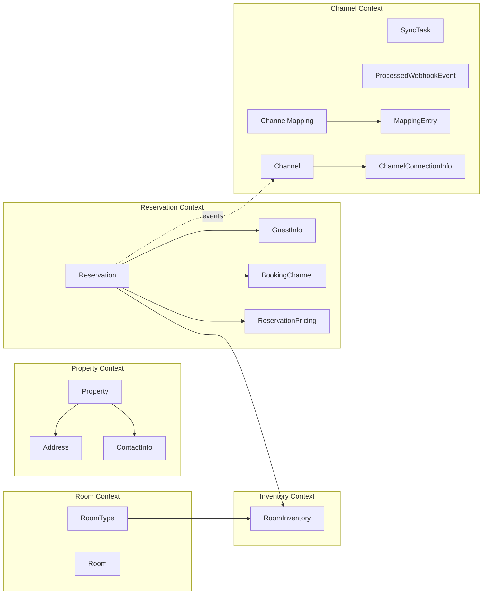

# StayOps Domain Model & Function Catalog (AS-IS)

작성일: 2026-04-11

이 문서는 모듈 분리 전 코드 기준의 도메인 모델, 소유 데이터, 기능을 정리한다. 목적은 각 Bounded Context가 어떤 데이터를 유일하게 관리하고 어떤 기능을 독점해야 하는지 확인하는 것이다.

## 기준

- Aggregate Root는 트랜잭션 일관성의 진입점이다.
- Entity/Value Object는 Aggregate Root를 통해 접근하고 수정한다.
- 한 도메인의 핵심 기능은 다른 도메인에서 재구현하지 않는다.
- Application Service는 여러 도메인의 기능을 조합할 수 있지만, 다른 도메인의 내부 규칙을 복제하지 않는다.

## Context별 모델과 기능

| Context | Aggregate Root | 내부 Entity/VO | 소유 데이터 | 독점 기능 |
|---|---|---|---|---|
| Shared Kernel | 없음 | `Money`, `DateRange`, `PagedResult`, `IdGenerator` | 공통 값, 페이징 결과, ID 생성 포트 | 금액 연산, 날짜 범위 계산, 공통 ID 생성 계약 |
| Member | `Member` | `PropertyAccess`, `MemberRole`, `MemberStatus`, `PropertyRole` | 회원 식별자, 이메일, 비밀번호 해시, 시스템 역할, 숙소 접근 권한, 회원 상태 | 숙소 접근권 부여/회수, 로그인 기록, 회원 비활성화 |
| Property | `Property` | `Address`, `ContactInfo`, `PropertyType`, `PropertyStatus` | 숙소 기본 정보, 운영 상태, 타임존, 통화, 소유자 | 숙소 활성화/비활성화/정지, 예약 가능 여부 판정, 숙소 정보 수정 |
| Room | `RoomType`, `Room` | `RoomStatus` | 객실 타입, 기본 요금, 수용 인원, 실물 객실 번호/층/상태 | 객실 타입 정보 수정, 객실 체크인/체크아웃/청소/정비 상태 전이 |
| Inventory | `RoomInventory` | 없음 | 날짜별 객실 타입 재고, 전체 수, 예약 수, 차단 수, 낙관적 잠금 버전 | 재고 예약 차감, 예약 취소 복원, 판매 차단/해제, 총 재고 수 변경 |
| Rate | `RatePlan` | `DayOfWeekRate`, `RatePlanType`, `RatePlanStatus`, `RateResolver` | 객실 타입별 요금 정책, 채널/기간/요일 조건, 우선순위, 상태 | 요금제 활성/비활성, 조건별 요금 적용 여부 판정, 날짜별/기간별 요금 결정 |
| Guest | `Guest` | `VisitSummary`, `GuestTier` | 숙소별 고객 식별 정보, 등급, 방문 요약, 메모 | 방문 기록 반영, 등급 산정, 고객 정보 수정 |
| Reservation | `Reservation` | `GuestInfo`, `BookingChannel`, `ReservationPricing`, `ReservationSearchCriteria`, `ReservationStatus` | 예약 스냅샷, 투숙 기간, 상태, 객실 배정, 가격 스냅샷, 회원 연결 | 예약 생성, 확정, 체크인, 체크아웃, 취소, 노쇼 상태 전이 |
| Payment | `Payment` | `PaymentStatus`, `PaymentGateway`, gateway result/exception types | 결제 주문 ID, 금액, PG 키, 승인/실패/취소 상태 | 결제 승인, 실패 처리, 취소, 취소 실패 처리, PG 연동 포트 계약 |
| Channel | `Channel`, `ChannelMapping`, `SyncTask`, `ProcessedWebhookEvent` 후보 | `ChannelConnectionInfo`, `MappingEntry`, `MappingType`, `SyncTaskStatus`, `SyncTaskType`, `Channel*` enums | 예약 채널, OTA 연결 정보, 내부/외부 코드 매핑, ARI 동기화 태스크, 처리된 웹훅 | 채널 상태 전이, 매핑 추가/삭제/조회, SyncTask 처리/완료/실패/재시도, 웹훅 멱등성 기록 |
| Booking | 없음 | `BookingResult` | 없음 | 고객 예매 유스케이스 조합. Reservation, Payment, Inventory, Guest, Rate, Channel을 오케스트레이션 |
| Settlement | 없음 | DTO read model | 정산 조회 결과 | Reservation 기반 aggregation 조회 |
| Statistics | 없음 | DTO read model | 통계 조회 결과 | 월별 통계 조회 |
| Dashboard | 없음 | DTO read model | 대시보드 조회 결과 | 운영 요약 조회 |

## Function Ownership Rules

| 기능 | 반드시 소유할 Context | 현재 코드 위치 | 판정 |
|---|---|---|---|
| 숙소 예약 가능 여부 | Property | `Property.isBookable()` | 적합. Booking/Reservation은 결과를 사용만 해야 한다. |
| 객실 상태 전이 | Room | `Room.checkIn()`, `Room.checkOut()`, `Room.completeCleaning()`, `Room.startMaintenance()`, `Room.completeMaintenance()` | 적합. ReservationApplication은 객실 상태를 직접 바꾸지 않고 Room 메서드를 호출한다. |
| 날짜별 재고 차감/복원 | Inventory | `RoomInventory.reserve()`, `RoomInventory.release()`, `InventoryReservationPort` | 도메인 기능은 적합하다. 2026-04-12에 Booking/Reservation/Webhook/PendingReservationScheduler의 직접 참조를 `InventoryReservationPort`로 줄였다. |
| 재고 차단/해제 | Inventory | `RoomInventory.block()`, `RoomInventory.unblock()`, `AvailabilitySyncPort` | 적합. OTA 동기화 트리거는 `AvailabilitySyncPort`로 분리했고 Channel adapter가 기존 동기 처리에 위임한다. |
| 요금 결정 | Rate | `RatePlan.isApplicableTo()`, `RatePlan.priceForDate()`, `RateResolver.resolve*()` | 적합. 다른 Context가 가격 규칙을 직접 재구현하지 않아야 한다. |
| 고객 등급 산정 | Guest | `Guest.recordVisit()`, `Guest.calculateTier()` | 적합. Reservation 이벤트 handler가 Guest 기능을 호출하는 구조는 유지 가능하다. |
| 예약 생명주기 상태 전이 | Reservation | `Reservation.confirm()`, `checkIn()`, `checkOut()`, `cancel()`, `cancelPending()`, `noShow()` | 적합. 재고/결제와의 원자성 계약은 Application orchestration에서 별도 명시가 필요하다. |
| 결제 생명주기 상태 전이 | Payment | `Payment.approve()`, `fail()`, `cancel()`, `failCancel()` | 적합. PG 연동 실패 분류는 PaymentGateway 계열 타입에 집중되어 있다. |
| 채널 상태/매핑/동기화 태스크 | Channel | `Channel.*`, `ChannelMapping.*`, `SyncTask.*` | 대체로 적합. 다만 Channel Context가 마스터 데이터, 매핑, outbox, webhook idempotency를 모두 포함하므로 하위 도메인 경계가 필요하다. |
| 고객 예매 생성/결제 확인/취소 | Booking 또는 Reservation+Payment Application | `BookingApplication` | 진단 필요. 자체 도메인 모델이 없어 BC라기보다 고객 예매 use case module에 가깝다. |

## Aggregate Root 접근성 검토

| Aggregate | 현재 접근 방식 | 리스크 |
|---|---|---|
| `Member` | private constructor + factory/reconstitute, immutable copy 기반 | `PropertyAccess`는 내부 VO로 다뤄지는 것이 자연스럽다. |
| `Property` | private constructor + factory/reconstitute, 상태 전이 메서드 제공 | `Instant.now()`가 도메인 내부에 남아 있어 테스트 제어성과 순수성 측면의 후속 진단 대상이다. |
| `RoomType`, `Room` | private constructor + factory/reconstitute, 상태/정보 변경 메서드 제공 | `RoomApplication -> RoomInventoryApplication` 직접 호출이 모듈 분리 blocker다. |
| `RoomInventory` | private constructor + factory/reconstitute, 계산 속성/재고 변경 메서드 제공 | 재고 예약/해제는 `InventoryReservationPort`, 가용 재고 동기화는 `AvailabilitySyncPort`로 외부 구현체 참조를 줄였다. |
| `RatePlan` | private constructor + factory/reconstitute, 요금 적용 조건과 가격 산출 보유 | 적합. `RateResolver`가 순수 도메인 서비스로 남아 있다. |
| `Guest` | private constructor + factory/reconstitute, 방문 기록/등급 산정 보유 | 적합. |
| `Reservation` | private constructor + factory/reconstitute, 상태 전이 보유 | 적합. 다만 생성 유스케이스가 Inventory, Rate, Guest, Channel을 직접 조합하므로 Application port 설계가 필요하다. |
| `Payment` | private constructor + factory/reconstitute, 상태 전이 보유 | 적합. `orderId` 생성 규칙은 Payment 내부에 있으나 시간 입력 방식은 후속 검토 대상이다. |
| `Channel` | private constructor + factory/reconstitute, 상태 전이 보유 | 적합. |
| `ChannelMapping` | private constructor + factory/reconstitute, 매핑 중복 검증 보유 | 적합. |
| `SyncTask` | private constructor + factory/reconstitute, 재시도 상태 전이 보유 | 적합. `UUID.randomUUID()` 직접 호출은 후속 검토 대상이다. |
| `ProcessedWebhookEvent` | public data class, 기본 timestamp | Aggregate Root로 볼지 Entity/record로 볼지 애매하다. webhook idempotency 하위 도메인의 소유 모델로 재분류가 필요하다. |

## 모듈 분리 전 금지할 중복 구현

- 재고 잔여 수 계산, 예약 수 증가/감소, 차단 수 증가/감소는 Inventory 밖에서 직접 구현하지 않는다.
- 수수료와 순매출 계산은 ReservationPricing 또는 정산 read model의 명시된 계산 정책 외부에서 재구현하지 않는다.
- 요금 우선순위와 채널별/요일별/기간별 적용 조건은 Rate 밖에서 재구현하지 않는다.
- 회원의 숙소 접근권 부여/회수는 Member 밖에서 직접 리스트를 조작하지 않는다.
- OTA 동기화 재시도와 backoff 정책은 SyncTask 밖에서 재구현하지 않는다.
- 결제 승인/취소 상태 전이는 Payment 밖에서 status 값을 직접 대입하지 않는다.
