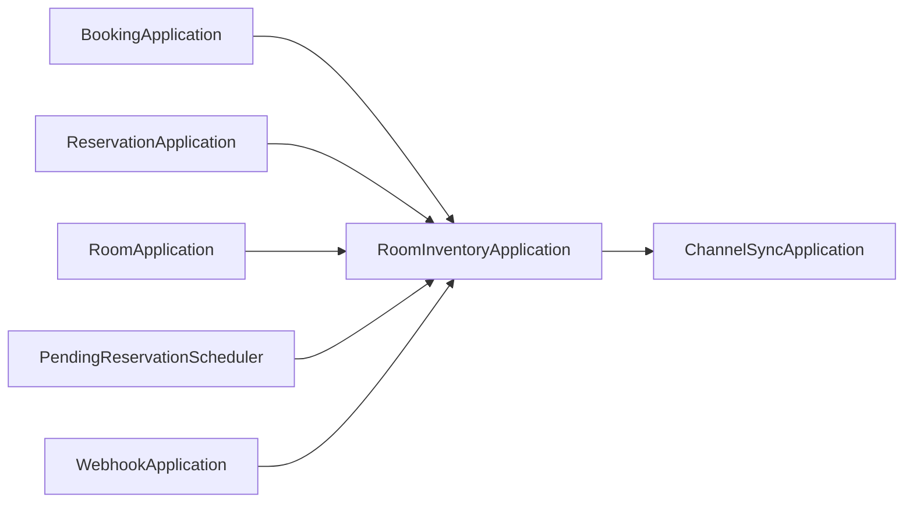

# StayOps Domain Diagnosis Log

작성일: 2026-04-11

이 문서는 모듈 분리 전 사용자와 논의한 결정, 코드 분석 결과, 문제 진단을 누적 기록한다. 결론이 바뀌면 같은 문서에 날짜별로 추가한다.

## 2026-04-11 논의 결정

| 항목 | 결정 | 근거 |
|---|---|---|
| 브랜치 | 새 브랜치를 만들지 않고 현재 `refactor/domain-module`에서 진행 | 사용자 확인 |
| 그림 형식 | Mermaid | Markdown diff와 유지보수 용이성 |
| 1차 범위 | 문서화와 진단을 끝낸 뒤 모듈 분리 착수 | 사용자 확인 |
| 모듈 토폴로지 | BC별 전체 레이어 모듈 | 현재 패키지가 `api/application/domain/infrastructure`를 BC별로 이미 갖고 있어 이동 비용이 낮음 |
| 진행 방식 | 하위 단계별 작업 후 멈춤 | `AGENTS.md`의 Phase process 준수 |

## 참조한 DDD 기준

카카오페이 기술 블로그의 DDD 적용 글에서 이번 작업에 직접 적용할 기준은 다음이다.

- Bounded Context는 도메인 모델이 적용되는 명시적 경계다.
- Context는 관리 가능한 하위 도메인으로 분할한다.
- Bounded Context는 Gradle subproject의 단위가 된다.
- Aggregate는 데이터 일관성을 유지하는 트랜잭션 경계다.
- Aggregate 내부 Entity와 Value Object는 Aggregate Root를 통해 접근하고 수정한다.
- 도메인 기능은 해당 도메인을 통해서만 실행되도록 분리한다.
- 도메인 모델은 도메인에 종속된 데이터를 유일하게 관리하고 비즈니스 규칙을 포함한다.

## AS-IS 구조 진단

### P1. Application 간 직접 참조가 모듈 분리 blocker다

확인된 직접 참조:

- `booking/application/service/BookingApplication.kt` -> `inventory/application/service/RoomInventoryApplication.kt`
- `reservation/application/service/ReservationApplication.kt` -> `inventory/application/service/RoomInventoryApplication.kt`
- `room/application/service/RoomApplication.kt` -> `inventory/application/service/RoomInventoryApplication.kt`
- `payment/infrastructure/scheduler/PendingReservationScheduler.kt` -> `inventory/application/service/RoomInventoryApplication.kt`
- `channel/application/service/WebhookApplication.kt` -> `inventory/application/service/RoomInventoryApplication.kt`
- `inventory/application/service/RoomInventoryApplication.kt` -> `channel/application/service/ChannelSyncApplication.kt`

영향:

- BC별 Gradle subproject로 바로 분리하면 `inventory`가 중심 의존성으로 올라서고, `inventory -> channel` 때문에 순환 의존이 생길 가능성이 높다.
- Booking과 Reservation이 필요한 기능은 재고의 `reserve/release` 계약이지만, 실제로는 Inventory 관리자 유스케이스와 OTA sync 트리거까지 포함한 `RoomInventoryApplication` 전체에 결합되어 있다.
- 해결 방향은 Application이 다른 Application을 호출하지 않고, 필요한 계약을 소유 BC의 port로 노출하는 것이다.

### P2. Booking은 도메인 모델이 없는 유스케이스 모듈이다

현재 `booking/domain` 디렉터리가 없고, `BookingApplication`이 Reservation, Payment, Inventory, Guest, Rate, Property, Room, Channel을 조합한다.

판정:

- 고객 예매라는 유스케이스 이름으로는 유효하다.
- 다만 Aggregate Root가 없으므로 DDD Bounded Context로 보기보다 Reservation과 Payment를 조합하는 application module로 볼 여지가 크다.
- 모듈 분리에서는 `stayops-booking`을 만들 수 있지만, 장기적으로는 `reservation-application` 또는 `customer-booking-usecase` 성격인지 재논의해야 한다.

### P3. Inventory는 도메인 기능은 적합하지만 외부 호출 경계가 넓다

`RoomInventory`는 `reserve`, `release`, `block`, `unblock`, `updateTotalCount`를 보유하므로 재고 변경 규칙 자체는 Aggregate에 있다.

문제:

- 여러 Context가 `RoomInventoryApplication`을 직접 주입받는다.
- `RoomInventoryApplication`은 재고 변경 후 `ChannelSyncApplication`을 직접 호출한다.
- 재고 변경과 OTA sync의 관계가 동기 호출인지 도메인 이벤트인지 port 계약인지 모듈 경계상 명확하지 않다.

초기 해결 후보:

- `InventoryReservationPort`: 예약/예매/만료 스케줄러가 필요한 `reserve/release` 계약만 Inventory가 소유한다. 2026-04-12에 Booking/Reservation/Webhook/PendingReservationScheduler에 적용했다.
- `AvailabilitySyncPort`: Inventory가 Channel Application을 직접 호출하지 않고 OTA 가용 재고 동기화 요청 계약에 의존한다.
- 대규모 이벤트 전환은 원자성 요구사항을 먼저 검토한 뒤 진행한다.

2026-04-12 변경 후 남은 직접 참조:

- `room/application/service/RoomApplication.kt` -> `inventory/application/service/RoomInventoryApplication.kt`
- `inventory/application/service/RoomInventoryApplication.kt` -> `channel/application/service/ChannelSyncApplication.kt`

### P4. Channel Context가 여러 하위 도메인을 포함한다

Channel에는 `Channel`, `ChannelMapping`, `SyncTask`, `ProcessedWebhookEvent`가 함께 있다.

판정:

- `Channel`: 채널 마스터 데이터.
- `ChannelMapping`: PMS 내부 코드와 OTA 외부 코드 매핑.
- `SyncTask`: OTA ARI push outbox.
- `ProcessedWebhookEvent`: webhook idempotency record.

모듈 분리 1차에서는 하나의 `stayops-channel`로 유지하되, 문서상 하위 도메인을 명시한다. 이후 복잡도가 커지면 `channel-sync` 또는 `channel-webhook` 하위 모듈 분리를 검토한다.

### P5. Read model Context는 도메인 모듈 우선순위가 낮다

`Settlement`, `Statistics`, `Dashboard`는 현재 Aggregate Root가 없고 DTO 기반 조회 모델로 동작한다.

판정:

- 별도 Gradle module로 분리할 수는 있다.
- 다만 DDD 도메인 모델 추출의 1차 대상은 아니다.
- 의존성 방향은 읽기 모델이 원천 Context 데이터를 조회하는 방향으로 고정해야 한다.

## 문서 Drift 메모

- `docs/ubiquitous-language.md`의 일부 설명은 현재 코드와 차이가 있다. 예: `ChannelConnectionInfo` 문서에는 `apiKey`, `apiSecret`, `webhookSecret`이 언급되지만 현재 코드는 `apiEndpoint`만 가진다.
- `PropertyAccess`는 기존 `01-bounded-context-map.md`에서 Entity로 표시되었지만, 현재 코드는 식별자가 없는 값 객체에 가깝다.
- `ProcessedWebhookEvent`는 기존 문서에서 Aggregate Root 또는 Entity로 혼재될 수 있다. 모듈 분리 전 소유권과 분류를 다시 잠근다.

## 다음 하위 단계 후보

다음 단계는 `docs/domain-model/04-gradle-module-plan.md`를 작성하여 Gradle subproject 목록, 허용 의존 방향, 1차 분리 순서를 확정하는 것이다.

그 전까지 코드 이동이나 build script 변경은 하지 않는다.
